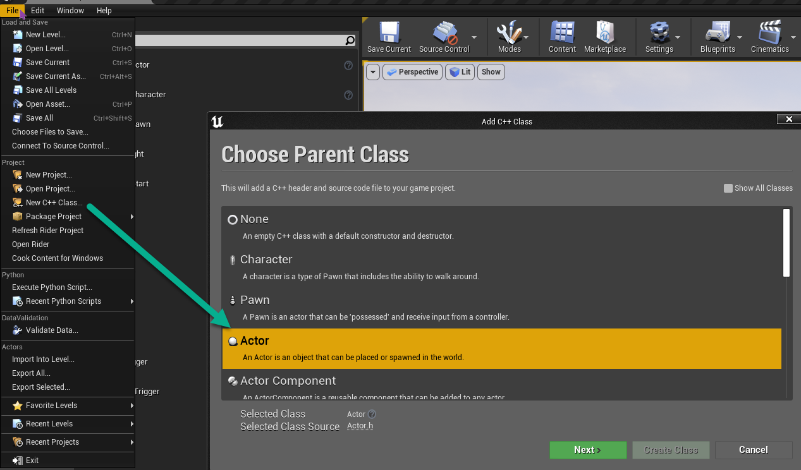
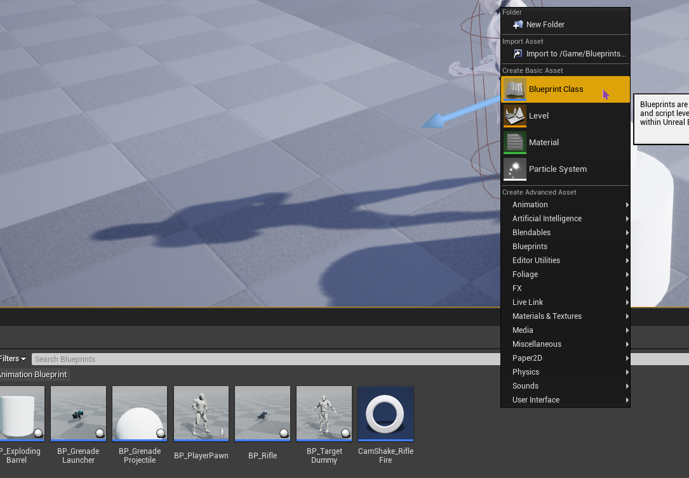
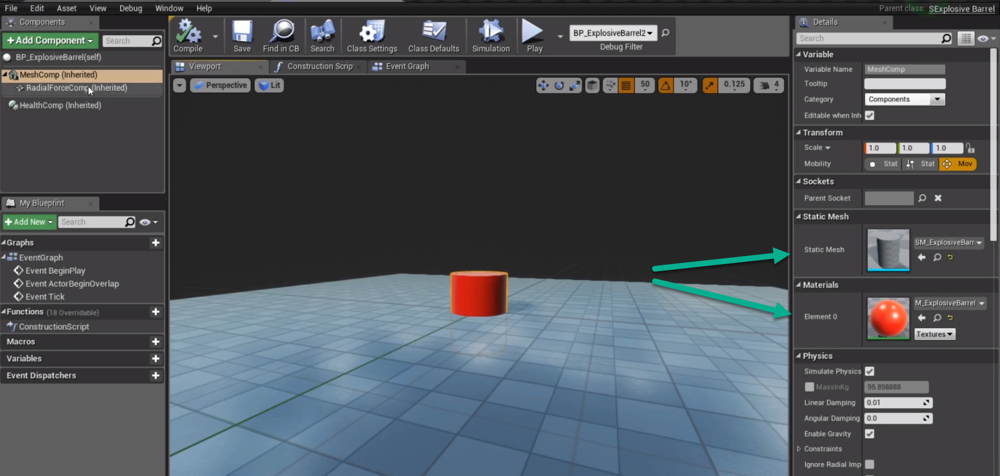

# Creating an Exploding Barrel

This guide will cover the C++ code required to create an exploding barrel.

## Create New CPP Class

In the Unreal Engine create new new C++ Class, and use the actor type.



### Adding Components to header

In the SExplosiveBarrel.h file we can add components to the protected section.


```c++
//Forward declare the class so the compiler knows what it is
class USHealthComponent;
class UStaticMeshComponent;
class URadialForceComponent;
class UParticleSystem;

// Custom Health Component for taking damage
UPROPERTY(VisibleAnywhere, Category = Components)
USHealthComponent* HealthComp;

// Mesh Component for the barrel
UPROPERTY(VisibleAnywhere, Category = Components)
UStaticMeshComponent* MeshComp;

// Radial Force Component for the explosion
UPROPERTY(VisibleAnywhere, Category = Components)
URadialForceComponent* RadialForceComp;

/*
	Add class properties and methods
*/

UFUNCTION()
void OnHealthChanged(USHealthComponent* OwningHealthComp, float Health, float HealthDelta, const class UDamageType* DamageType, class AController* InstigatedBy, AActor* DamageCauser);

bool bExploded

// Impule force to apply to the barrel when it explodes to boost it up
UPROPERTY(EditDefaultsOnly, Category = FX)
float ExplosionImpulse;

// Particle system to play when the barrel explodes
UPROPERTY(EditDefaultsOnly, Category = FX)
UParticleSystem* ExplosionEffect;

UPROPERTY(EditDefaultsOnly, Category = FX)
UMaterialInterface* ExplodedMaterial;
```

### Add Components to the actor

I'm not sure on the best workflow here.  Do we add all the known components first then configure them, or do we configure each component one at a time.  Will put my thoughts here once I've created a few more components.

#### Health Component

Next we need to add the components that make up the barrel.  We can do this through C++ which is similiar to selecting add component in the BP editor.

`SExplosiveBarrel.cpp`
```c++
// Adding Components can be done in the constructor method.
ASExplosiveBarrel::ASExplosiveBarrel()
{
	// Add the Health Component
	HealthComp = CreateDefaultSubobject<USHealthComponent>(TEXT("HealthComp"));
	// AddDynamic adds a delegate to broadcast custom events
	HealthComp->OnHealthChanged.AddDynamic(this, &ASExplosiveBarrel::OnHealthChanged);
}

void ASExplosiveBarrel::OnHealthChanged(USHealthComponent* OwningHealthComp, float Health, float HealthDelta, const class UDamageType* DamageType, class AController* InstigatedBy, AActor* DamageCauser)
{
	if (bExploded)
	{
		// Do nothing since the barrel has already exploded
		return;
	}

	// If the health is zero, explode the barrel
	if (Health <= 0.0f)
	{
		// Set the exploded flag
		bExploded = true;

		FVector BoostIntensity = FVector::UpVector * ExplosionImpulse;
		MeshComp->AddImpulse(BoostIntensity, NAME_None, true);

		// Play the explosion effect
		UGameplayStatics::SpawnEmitterAtLocation(this, ExplosionEffect, GetActorLocation());

		// Apply radial force to the barrel
		RadialForceComp->FireImpulse();

		// Change the material of the barrel to exploded material
		MeshComp->SetMaterial(0, ExplodedMaterial);
	}
}
```

#### Mesh Component

Adding the mesh component to the barrel


```c++
ASExplosiveBarrel::ASExplosiveBarrel()
{
	// Health Comp Code ...

	MeshComp = CreateDefaultSubobject<UStaticMeshComponent>(TEXT("MeshComp"));
	MeshComp->SetSimulatePhysics(true);
	// Set Physics body to let radial component affect us (example of when we are standing close)
	MeshComp->SetCollisionObjectType(ECC_PhysicsBody); // Physics Body is required for the radial force component to work
	MeshComp->SetMobility(EComponentMobility::Movable); // Required for Impulse to work
	RootComponent = MeshComp;
}
```

#### Radial Force Component

Applies a Radial force that represents an explosion.

```c++
ASExplosiveBarrel::ASExplosiveBarrel()
{
	// Health Comp Code ...

	// Mesh Comp Code ...

	RadialForceComp = CreateDefaultSubobject<URadialForceComponent>(TEXT("RadialForceComp"));
	RadialForceComp->SetupAttachment(MeshComp);
	RadialForceComp->Radius = 250;
	RadialForceComp->bImpulseVelChange = true;
	RadialForceComp->bAutoActivate = false; // Prevent component from ticking, so we use it through the FireImpulse method instead
	RadialForceComp->bIgnoreOwningActor = true;

	ExplostionImpulse = 400;
}
```

## Create Blueprint from ASexplosiveBarrel C++ Class

In Unreal engine we need to create a new Blueprint, select SExplodingBarrel in the `All Classes` list.




### Configure Exploding Barrel in Unreal

Here we can add the particle effect and the material to the barrel.

